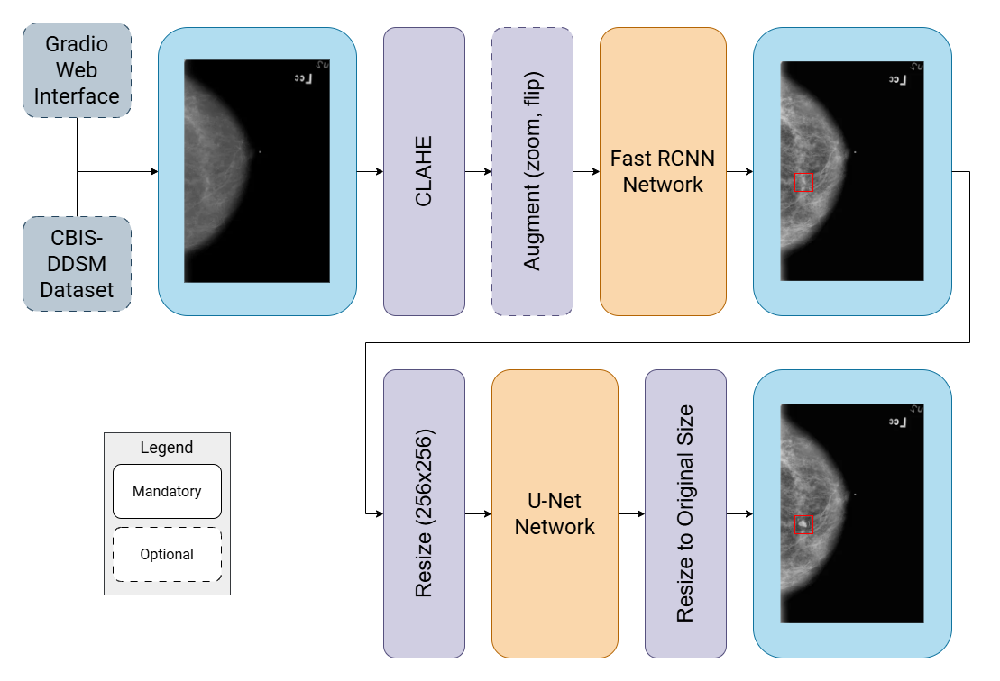

# MammoVision

## Contributors

* Gergely Füstös - [@fustosgergo](https://github.com/fustosgergo)
* Kristóf Pásztor - [@pasztork](https://github.com/pasztork)
* Marcell Tóth - [@tmb2k01](https://github.com/tmb2k01)

## Project Overview

This project focuses on mammographic tumor detection and segmentation using medical image processing techniques. The CBIS-DDSM dataset, which contains a variety of film mammography studies, is leveraged for this purpose. The main goal of the project is to develop a model that detects and segments tumor regions in mammographic films, aiding in diagnosis and treatment planning for patients. Additionally, a web service is created that accepts a DICOM file, performs tumor detection and segmentation, and returns the results, providing a valuable tool for medical professionals.

## Model Workflow and Inference

The following flowchart provides an overview of the model's workflow, including the steps involved during inference and training:

The process begins with the input of a DICOM file, followed by preprocessing, tumor detection using the detection model, and segmentation of the detected regions using the segmentation model. The final output includes bounding boxes and segmentation masks for the tumor regions.

## Documentation

For more details on specific parts of our project, please refer to the following:

* [Data Analysis](doc/data_analysis.md): A comprehensive analysis of the dataset.
* [Data Preparation](doc/data_preparation.md): Steps for preparing mammographic images for the model.
* [Model Evaluation](doc/model_evaluation.md): Results and analysis of the performance of the final model.
* [Model Implementation](doc/model_implementation.md): Describes how the detection and segmentation models work.
* [Project Plan](doc/project_plan.md): Outline of the overall project objectives, timelines, and milestones.
* [Web Service](doc/web_service.md): A step-by-step guide to launching the web service for breast tumor detection and segmentation.
