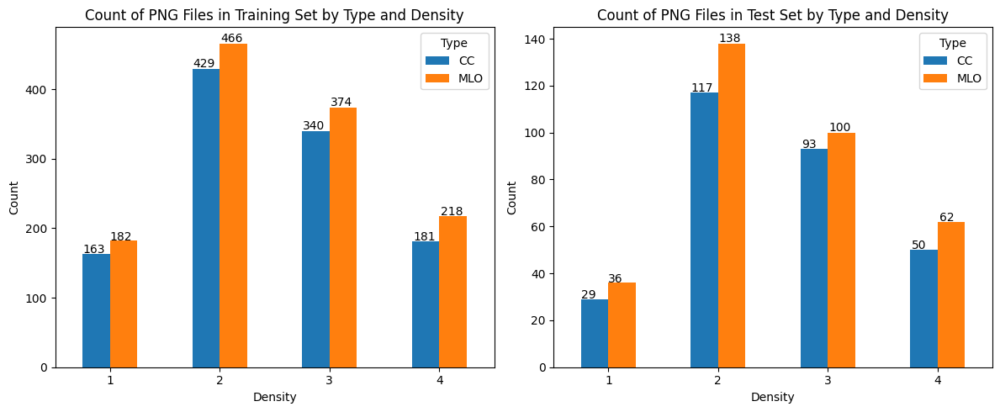
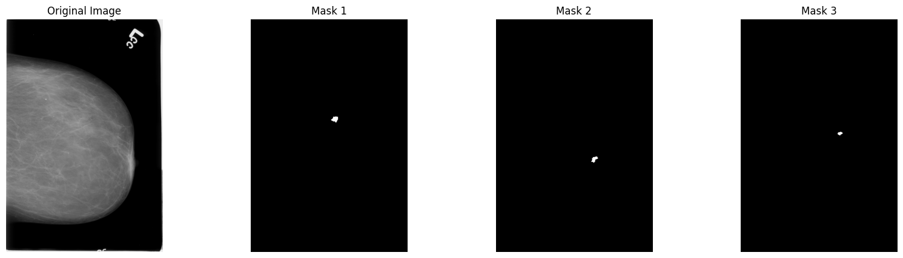
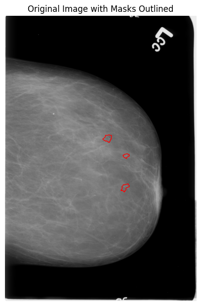
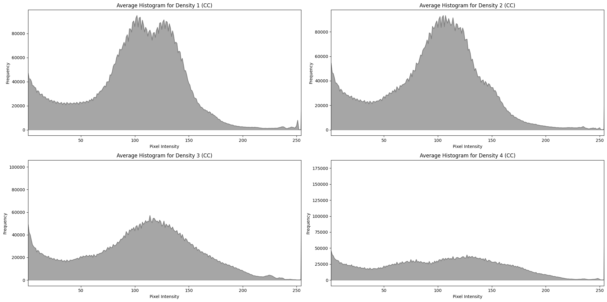
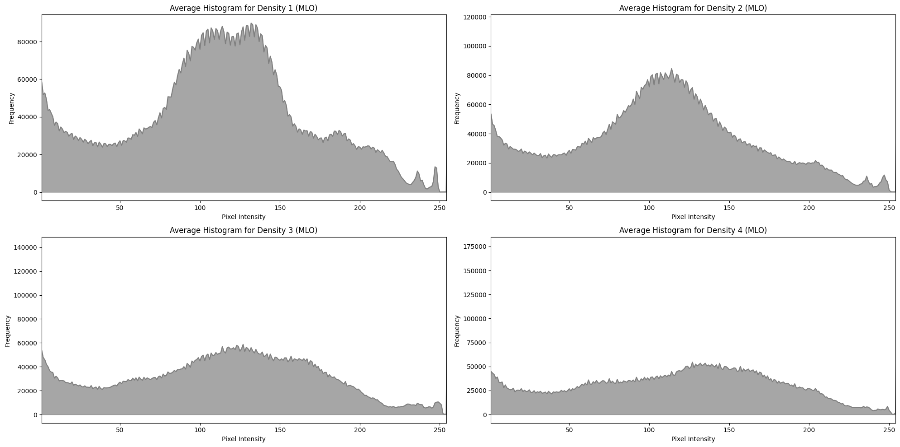
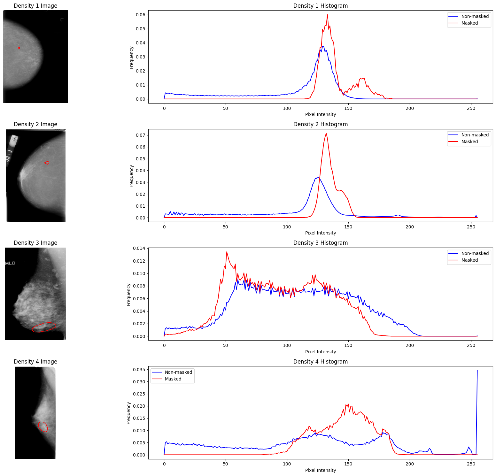
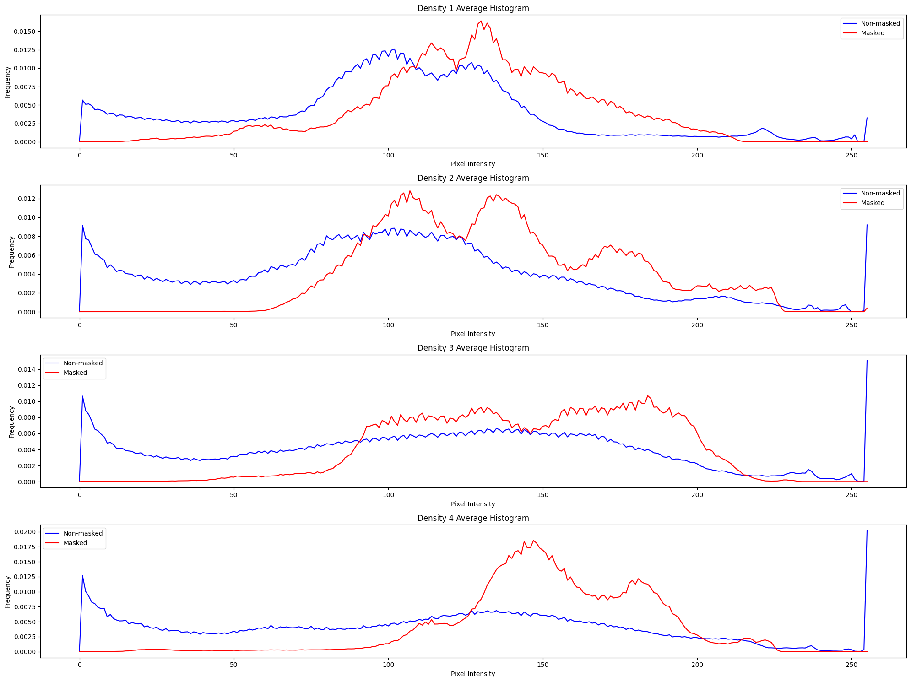
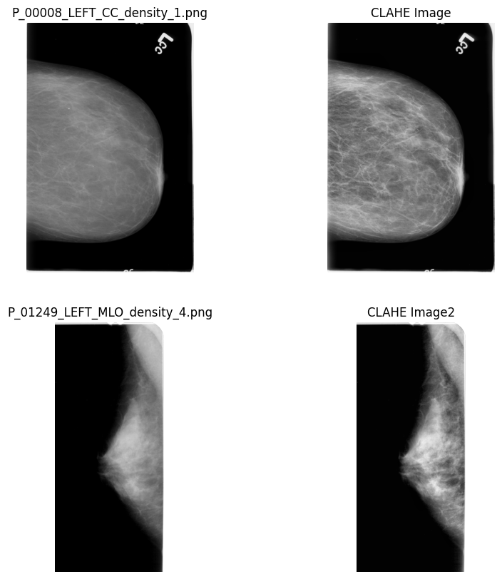
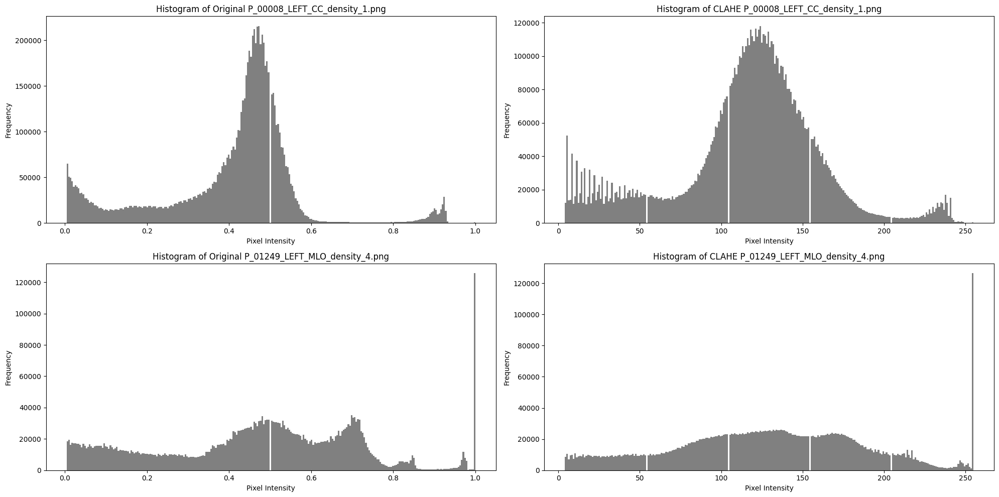

# Data Analysis

## 1. Dataset Overview

The dataset used in this project is the CBIS-DDSM (Curated Breast Imaging Subset of DDSM). It is a publicly available dataset specifically designed for the detection and segmentation of breast tumors, as well as the classification of benign and malignant lesions.

* **Name**: CBIS-DDSM (Curated Breast Imaging Subset of DDSM)
* **Description**: A curated subset of the Digital Database for Screening Mammography (DDSM), containing annotated mammographic images with tumor segmentation masks and pathology-confirmed labels (benign or malignant).
* **Reference**: Lee et al., "Curated Breast Imaging Subset of DDSM," The Cancer Imaging Archive (TCIA), 2017.
Available at: [https://www.cancerimagingarchive.net/collection/cbis-ddsm/](https://www.cancerimagingarchive.net/collection/cbis-ddsm/)
* **License**: Creative Commons Attribution 3.0 Unported (CC BY 3.0)
* **Release Date**: 2017

## 2. Dataset Properties

The dataset consists of mammographic images and corresponding segmentation masks for tumor detection. Notably, there is no data where we cannot find any tumor—every image contains at least one tumor region. Below are the key details regarding the dataset structure and metadata:

### 2.1 Metadata Information

The dataset includes various metadata attributes related to image acquisition and patient information.

* **Breast Density:** Scale from 1 to 4, indicating the proportion of dense tissue in the breast, which can affect the accuracy of tumor detection.
* **Breast Laterality:** Specifies whether the image is of the left or right breast.
* **Image View:** CC (Cranio-Caudal) or MLO (Mediolateral Oblique), representing different angles used in mammography.

### 2.2 Abnormality Information

The dataset provides details on detected abnormalities in mammographic images:

* **Abnormality Type:** Describes the type of abnormality present, such as mass or calcification.
* **Calcification Type:** Specifies the type of calcifications present, such as pleomorphic, amorphous, or N/A.
* **Calcification Distribution:** Describes how calcifications are spread within the breast tissue (e.g., clustered, linear, segmental).
* **Pathology:** Defines whether the abnormality is **benign or malignant**, critical for diagnosing breast cancer.
* **Subtlety Score:** A rating (from 1 to 5) indicating how difficult the abnormality is to detect, where higher values represent more subtle findings.

### 2.3 Patient Metadata (Relevant Fields)

Patient metadata provides additional context about the images:

* **Patient ID:** A unique identifier for each patient.
* **Patient Birth Date:** Useful for age-related analysis.
* **Laterality:** Indicates whether the affected breast is left or right.
* **Study Date:** The date when the imaging study was conducted.
* **Study ID:** A unique identifier for the imaging study.
* **Series Description:** A textual description of the image series, providing additional context (e.g., cropped images, full mammogram images).

This structured dataset enables detailed analysis of mammographic images, including tumor segmentation and classification based on various metadata attributes.

### 2.4 Dataset Statistics

#### Training Set

* **Images:** 2,353
* **Masks:** 2,797
* **Images with multiple tumors:** 263 (resulting in multiple masks per image)

#### Test Set

* **Images:** 627
* **Masks:** 688
* **Images with multiple tumors:** 52

### Data Distribution by Type and Density

### Tumor Type Distribution

#### Training Dataset

* **Mass Masks:** 1,253
* **Calcification Masks:** 1,544

#### Test Dataset

* **Mass Masks:** 365
* **Calcification Masks:** 323

## 3. Data Properties

### 3.1. Input Format

Our dataset consists of DICOM files, which we convert to PNG format with a single channel and 8-bit depth. This conversion significantly reduces the dataset size while preserving essential information, making it a practical choice for our analysis.

In addition to the PNG input images, we have corresponding tumor masks. Each tumor is assigned its own mask, meaning that a single PNG image may have multiple associated masks.

It is important to note that the **image sizes in the dataset are inhomogeneous**, which should be considered when preprocessing and training models.

Below is an example of our training data, showcasing a PNG image alongside its corresponding tumor masks:

The same example is shown again, but this time with the masks outlined on the original image for better visualization:

### 3.2. Histogram Analysis

#### 3.2.1. Histogram Analysis by Breast Density

The density of breast tissue significantly influences the brightness of mammographic images. Fattier breast tissue generally results in darker images, whereas denser tissue produces brighter images. To investigate this effect, we analyzed the average histogram of images grouped by density values and imaging types (CC or MLO). Each histogram represents the average of 50 images, though similar trends are consistently observed across both smaller and larger sample sizes.

**CC View Histograms:**

As shown in the figure, images with density levels 1 and 2 (fattier tissue) predominantly contain darker pixels, while images with density levels 3 and 4 (denser tissue) exhibit a more uniform, flatter histogram distribution. The difference between low and high-density images is distinct, with higher-density images having a wider spread of pixel intensity values.

**MLO View Histograms:**

The histograms for the MLO view follow a similar pattern to those of the CC view. However, an important observation is that the distinction between density levels 3 and 4 is less pronounced in the MLO view compared to the CC view. This suggests that, in some cases, imaging modality may influence the appearance of density-based variations.

#### 3.2.2. Histograms of Tumor and Non-Tumor Regions

To gain a deeper understanding of tumor characteristics in the images, we analyzed the histograms of tumor and non-tumor regions separately. Since histogram distributions vary across density levels, we grouped the analysis accordingly.

##### Example Images with Normalized Tumor and Non-Tumor Histograms

As seen in the image above, tumors exhibit different histogram characteristics depending on the breast density level. For density levels 1 and 2 (fattier tissue), tumor histograms tend to be slightly shifted to the right (brighter) compared to the non-tumor regions. In contrast, for density levels 3 and 4 (denser tissue), tumor and non-tumor histograms overlap significantly, making them harder to distinguish.

To validate this observation, we computed the average histogram of 50 images per density level, similar to our previous analysis. The resulting histograms are shown below:

These results confirm our earlier findings: in lower density images (levels 1-2), tumor regions appear slightly brighter than the surrounding tissue, whereas in higher density images (levels 3-4), the difference becomes less distinguishable.

Given these findings, we anticipate that detecting tumors in higher-density breast images will be more challenging, as tumor regions blend more seamlessly with surrounding tissue.

### 3.3. Contrast Enhancement Using CLAHE

Tumors in mammographic images can be challenging to detect, especially in higher-density breast tissue where they blend with the surrounding structures. To improve tumor visibility, we enhance image contrast using **Contrast Limited Adaptive Histogram Equalization (CLAHE)**.

CLAHE works by applying adaptive histogram equalization to small regions of the image rather than the entire image. This local approach enhances contrast in different parts of the image independently, preserving important details and preventing over-amplification of noise. Additionally, CLAHE limits contrast enhancement in areas with uniform intensity, avoiding artificial brightness shifts and excessive noise amplification.

The following figure demonstrates the effect of CLAHE on two sample images. The left side shows the original images, while the right side displays the same images after applying CLAHE.

As seen in the examples, CLAHE enhances contrast by brightening darker regions and improving the visibility of tumor structures without introducing excessive noise.

To analyze the impact of CLAHE quantitatively, we compared the histograms of images before and after enhancement. The following figure shows the changes in pixel intensity distribution:

The original images exhibit a narrow intensity distribution, especially in denser breast tissues. CLAHE broadens this distribution by redistributing pixel intensities more evenly, increasing contrast and making tumors more distinguishable from the surrounding tissue.

By applying CLAHE, we aim to enhance the visibility of tumors, particularly in high-density breast images, where natural contrast is lower.
