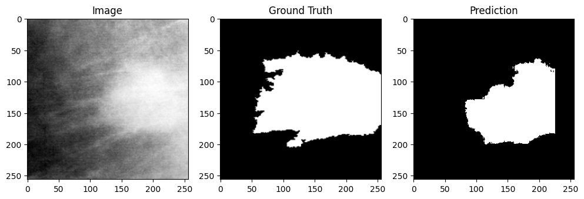
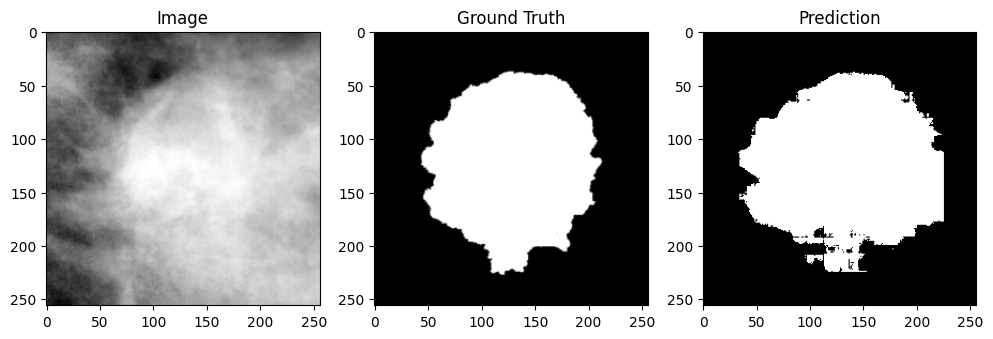
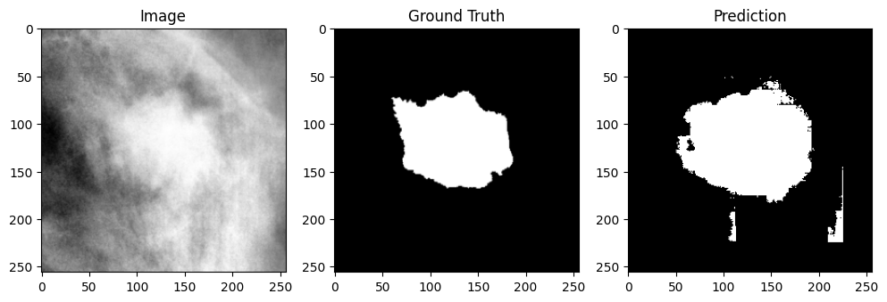

# Model Evaluation

This document presents the evaluation results for our breast tumor detection and segmentation models.

## Segmentation Model

### Evaluation Metrics

The model was evaluated based on the following metrics:

1. **Dice Score:** Measures the overlap between the predicted segmentation and the ground truth.
2. **Intersection over Union:** Measures the ratio of the intersection to the union of the predicted segmentation and the ground truth.

### Results

- **Dice Score**: 0.8
    The Dice Score indicates a high degree of overlap between the predicted segmentation and the ground truth. A score of 0.8 suggests that the model performs well in capturing the target regions with minimal false positives and false negatives.

- **IoU**: 0.7
    The IoU score of 0.7 demonstrates that the model achieves a strong balance between precision and recall, effectively identifying the intersection of predicted and ground truth regions relative to their union

### Visual Results: Predicted vs. Ground Truth Segmentations

To provide a clearer understanding of the segmentation model's performance, we present visual examples of its predictions compared to the ground truth.

### Example 1

### Example 2

### Example 3

