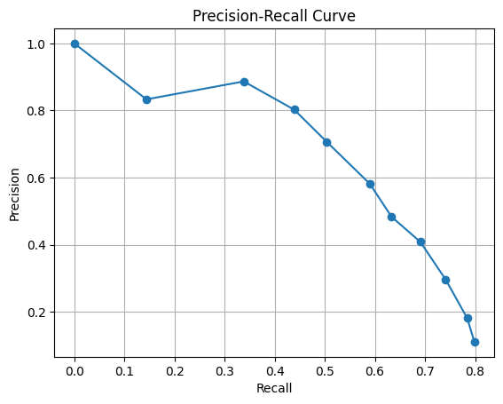
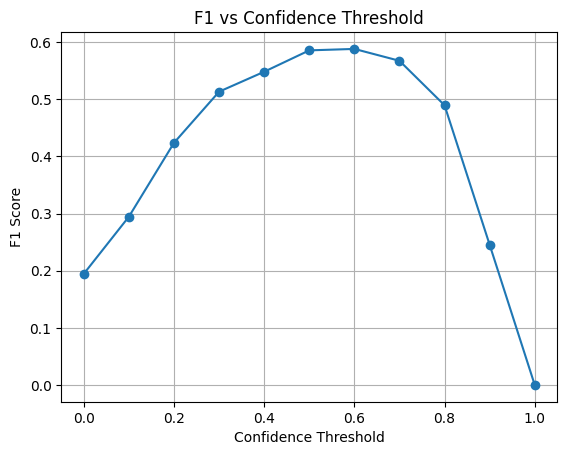
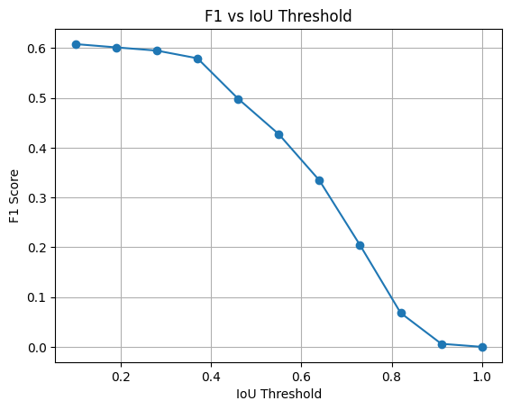
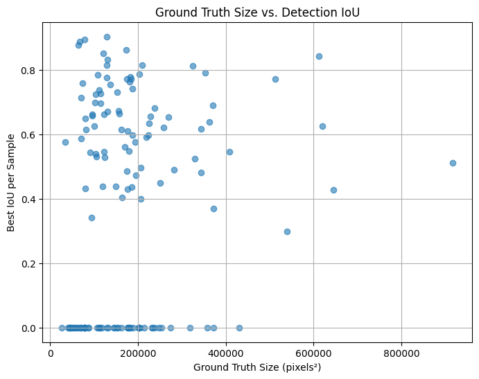
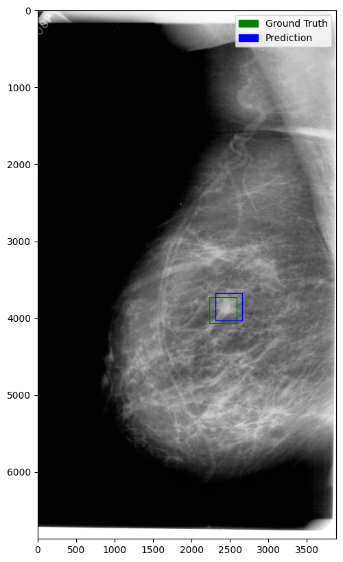
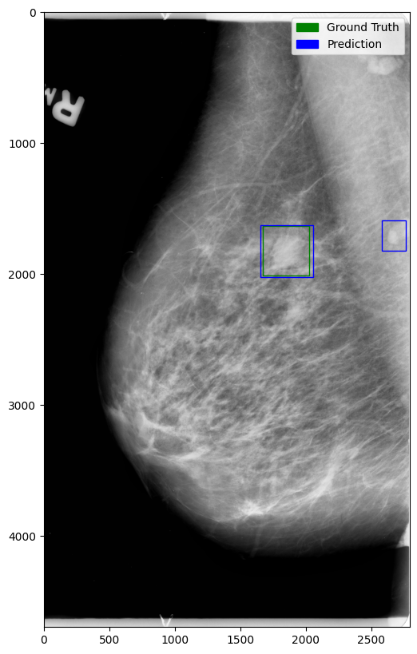
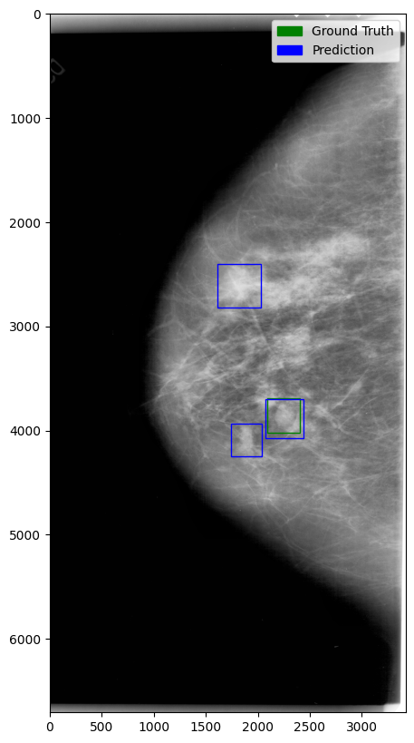

# Model Evaluation

This document presents the evaluation results for our breast tumor detection and segmentation models.

## Detection Model

### Evaluation Metrics

The detection model was evaluated using standard object detection metrics:

1. **Precision:** Measures the proportion of correct positive detections out of all predicted positives.
2. **Recall:** Measures the proportion of actual tumors correctly detected by the model.
3. **F1 Score:** Harmonic mean of precision and recall, providing a single metric that balances both.
4. **Mean IoU (All Cases):** Average Intersection over Union across all predictions, treating missed detections as 0 IoU.
5. **Mean IoU (True Positives Only):** Average IoU computed only for correctly detected tumors.

The evaluation thresholds (confidence and IoU) were selected by analyzing the **precision-recall curves** and **F1 score vs. threshold plots**.  
We chose the threshold values that achieved the best balance between precision and recall according to the model's behavior across different operating points.

### Results

- **Precision**: 0.6058  
   The model correctly identifies about 60.6% of its positive predictions, showing a moderate false positive rate.

- **Recall**: 0.5971  
   The model detects approximately 59.7% of the actual tumors, indicating reasonable sensitivity but also some missed cases.

- **F1 Score**: 0.6014  
   The F1 Score reflects a moderately balanced performance between precision and recall, important for maintaining reliable detection while controlling false positives.

- **Mean IoU (All Cases)**: 0.2738  
   This score accounts for all predictions, providing a realistic measure of overall localization accuracy, including both correct detections and misses.

- **Mean IoU (True Positives Only)**: 0.6367  
   When considering only true positive detections, the mean IoU of 0.6367 shows decent spatial alignment between predicted and ground truth bounding boxes.

---

### Threshold Analysis

To optimize the model’s operating point, we performed threshold analyses using three key plots:

#### Precision-Recall Curve for Confidence Thresholds

This plot shows how precision and recall vary as we adjust the confidence threshold.  
Initially, at very low thresholds, the model achieves high precision but low recall, meaning that while the few predictions it makes are accurate, it misses many true tumors.  
As the confidence threshold decreases, recall improves but precision gradually falls, reflecting the expected trade-off between sensitivity and specificity.

#### F1 Score vs. Confidence Threshold

This plot helps identify the optimal confidence threshold where the F1 score — balancing precision and recall — is maximized.  
The curve peaks around a confidence threshold of 0.5–0.6, suggesting this range provides the best balance between correctly identifying tumors and minimizing false detections.
Finally we went for 0.5, because we prioritised recall a bit more.

#### F1 Score vs. IoU Threshold

This plot shows how stricter IoU requirements affect the F1 score.  
At low IoU thresholds, the F1 score remains relatively high, indicating the model can find approximate tumor locations.  
However, as the IoU threshold increases, the F1 score drops sharply, suggesting that the model struggles with precise localization and is better at rough detection rather than exact bounding box fitting.

#### Summary

These analyses helped us select the final threshold settings (confidence = 0.5, IoU = 0.2), ensuring a reasonable trade-off between sensitivity (recall) and precision.  
The results also highlight areas for potential improvement, particularly in refining localization accuracy.

---

### Per-Ground Truth Box IoU vs. Size Analysis

To better understand the model’s detection behavior, we analyzed the relationship between the size of each ground-truth lesion and the best detection quality (measured by IoU).

For each ground-truth box:

- The lesion size was computed as the area of the annotated bounding box.
- The IoU between the ground-truth box and any predicted box was recorded.

The scatter plot below visualizes this relationship:

- **X-axis:** Ground truth box size (in pixel²)
- **Y-axis:** IoU score for the prediction

This analysis provides a more detailed view of the model’s performance, highlighting whether it struggles more with detecting smaller lesions.

Based on the plot, it appears that the model has more difficulty detecting smaller lesions:  
There is a noticeable concentration of small ground-truth boxes with low or even zero IoU values, suggesting that the model often misses or poorly localizes smaller abnormalities.

---

### Visual Results: Predicted Bounding Boxes

Examples of predicted bounding boxes compared to the ground truth annotations are provided below.

   
   
   

---

## Segmentation Model

### Evaluation Metrics

The model was evaluated based on the following metrics:

1. **Dice Score:** Measures the overlap between the predicted segmentation and the ground truth.
2. **Intersection over Union:** Measures the ratio of the intersection to the union of the predicted segmentation and the ground truth.

### Results

- **Dice Score**: 0.8
  The Dice Score indicates a high degree of overlap between the predicted segmentation and the ground truth. A score of 0.8 suggests that the model performs well in capturing the target regions with minimal false positives and false negatives.

- **IoU**: 0.7
  The IoU score of 0.7 demonstrates that the model achieves a strong balance between precision and recall, effectively identifying the intersection of predicted and ground truth regions relative to their union

### Visual Results: Predicted vs. Ground Truth Segmentations

To provide a clearer understanding of the segmentation model's performance, we present visual examples of its predictions compared to the ground truth.

### Example 1

### Example 2

### Example 3

## Conclusion

Both the segmentation and detection models show promising potential for breast tumor analysis.

The detection model provides a solid baseline for identifying tumors, although improvements are needed, particularly in precise localization and balancing sensitivity and specificity.
The segmentation model accurately delineates tumor regions with strong overlap between predictions and ground truth.

Thresholds were selected based on performance curve analyses to optimize the trade-off between precision and recall.  
Further fine-tuning, validation on larger datasets, and expert oversight are essential steps toward real-world deployment.
