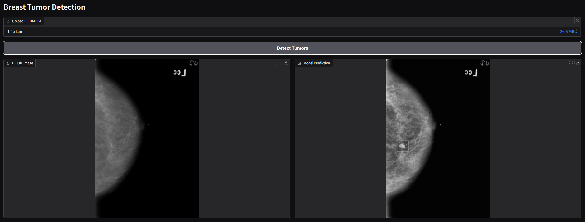

# Starting the Gradio Web Service

## Prerequisites

Before starting the web service, ensure that:
- You have already trained the model by setting the environment variable `TRAINING_MODE=ON` and running:
  ```sh
  export TRAINING_MODE=ON
  python3 -m src.main
  ```
- Once training is complete, disable training mode before running the service:
  ```sh
  export TRAINING_MODE=OFF
  python3 -m src.main
  ```

## Setting Up Model Parameters

The model parameters for both detection and segmentation models can be accessed from the following Google Drive link:

[Download Model Parameters](https://drive.google.com/drive/folders/17OGfgp_6Qo2nJUHEdNqRoSVjNeyKQdId?usp=sharing)

After downloading, place the model files inside a folder named `models` in the root of the project directory:

```sh
mkdir -p models
mv path-to-downloaded-files/* models/
```

## Running the Gradio Web Service

Once the model parameters are set up, start the Gradio web service using:

```sh
python3 -m src.main
```

The service should now be accessible via a local web interface.

## Preview of the Web Interface


